National Attentuation Factors Analysis Report
================
2025-06-23

### Load R Libraries

``` r
library(ggplot2)
suppressPackageStartupMessages(library(effects))
library(openxlsx)
```

### Input and format ANOVA data set

``` r
data<-openxlsx::read.xlsx("ANOVA_Raw Data.xlsx",sheet="ANOVA Data",check.names=FALSE,sep.names = "_")
data$`LOG(AF)`<-log10(data$AF)
data<-data[,names(data)!="AF"] #For simplicity, omit AF column as we are modelling log_10(AF).


#Establishing and ordering the correct factor levels for each categorical variable. 

data$CHEMICAL<-factor(as.character(data$CHEMICAL),levels=c("PCE","TCE","PCE and TCE"))

data$SAMPLE_TYPE<-factor(trimws(as.character(data$SAMPLE_TYPE)))
data$SAMPLE_TYPE<-factor(as.character(data$SAMPLE_TYPE),levels=c("SUBSLAB","NEAR-SLAB","ALL"))

data$BUILDING_TYPE<-factor(as.character(data$BUILDING_TYPE),levels=c("COMMERCIAL","INDUSTRIAL","INSTITUTIONAL","NON-RESIDENTIAL","RESIDENTIAL","ALL"))
data$FOUNDATION_TYPE<-factor(as.character(data$FOUNDATION_TYPE),levels=c("BASEMENT","CRAWL SPACE/EARTHEN FLOOR","SLAB-ON-GRADE","ALL"))
data$HVAC_OPERATION<-factor(as.character(data$HVAC_OPERATION),levels=c("HVAC-OFF","HVAC-ON","ALL"))

data$RELATIVE_VFC_SOURCE_DEPTH<-factor(as.character(data$RELATIVE_VFC_SOURCE_DEPTH),levels=c("SHALLOW SOIL","DEEP SOIL/GROUNDWATER","ALL"))

data$BUILDING_CONSTRUCTION_DATE<-factor(as.character(data$BUILDING_CONSTRUCTION_DATE),levels=c("PRE-1950","POST-1950","ALL"))
data$CLIMATE_ZONE<-factor(as.character(data$CLIMATE_ZONE),levels=c("ZONES 1-3","ZONES 4-7","ALL"))
data$PREDOMINANT_SOIL_TYPE<-factor(as.character(data$PREDOMINANT_SOIL_TYPE),levels=c("COARSER GRAINED","FINER GRAINED","ALL"))
data$CSSG_ASSUMPTION<-factor(as.character(data$CSSG_ASSUMPTION),levels=c("AVERAGE CSSG","MAXIMUM CSSG"))
data$CSSG_SAMPLE_DEPTH_Delta<-factor(as.character(data$CSSG_SAMPLE_DEPTH_Delta),levels=c("SUBSLAB (z < 3 ft)","3 <= z <= 5 ft","5 < z <=15","z <= 15 ft","z > 15 ft"))
data$TIME_Delta_BETWEEN_CIA_and_CSSG_SAMPLING<-factor(as.character(data$TIME_Delta_BETWEEN_CIA_and_CSSG_SAMPLING),levels=c("t <= 1 day","1 < t <= 14 days","14 < t <= 60 days","t > 60 days","t < 92 days"))
data$LATERAL_SEPARATION_Delta_BETWEEN_CIA_and_CSSG_SAMPLING<-factor(as.character(data$LATERAL_SEPARATION_Delta_BETWEEN_CIA_and_CSSG_SAMPLING),levels=c("x <= 10 ft","10 < x <=50","50 < x <=100","x < 110 ft"))


summary(data)
```

    ##         CHEMICAL       SAMPLE_TYPE           BUILDING_TYPE                   FOUNDATION_TYPE BUILDING_CONSTRUCTION_DATE    CLIMATE_ZONE 
    ##  PCE        : 306   SUBSLAB  :1201   COMMERCIAL     : 242   BASEMENT                 :  29   PRE-1950 : 126             ZONES 1-3: 386  
    ##  TCE        : 477   NEAR-SLAB: 768   INDUSTRIAL     :  76   CRAWL SPACE/EARTHEN FLOOR:  15   POST-1950: 208             ZONES 4-7: 156  
    ##  PCE and TCE:3763   ALL      :2577   INSTITUTIONAL  :  86   SLAB-ON-GRADE            : 209   ALL      :4212             ALL      :4004  
    ##                                      NON-RESIDENTIAL:1826   ALL                      :4293                                              
    ##                                      RESIDENTIAL    : 736                                                                               
    ##                                      ALL            :1580                                                                               
    ##          RELATIVE_VFC_SOURCE_DEPTH  HVAC_OPERATION     PREDOMINANT_SOIL_TYPE     CSSG_ASSUMPTION TIME_Delta_BETWEEN_CIA_and_CSSG_SAMPLING
    ##  SHALLOW SOIL         :  88        HVAC-OFF:  76   COARSER GRAINED:  34      AVERAGE CSSG: 272   t <= 1 day       : 163                  
    ##  DEEP SOIL/GROUNDWATER: 144        HVAC-ON : 147   FINER GRAINED  :  34      MAXIMUM CSSG:4274   1 < t <= 14 days :  62                  
    ##  ALL                  :4314        ALL     :4323   ALL            :4478                          14 < t <= 60 days:  71                  
    ##                                                                                                  t > 60 days      :  62                  
    ##                                                                                                  t < 92 days      :4188                  
    ##                                                                                                                                          
    ##  LATERAL_SEPARATION_Delta_BETWEEN_CIA_and_CSSG_SAMPLING       CSSG_SAMPLE_DEPTH_Delta    LOG(AF)       
    ##  x <= 10 ft  : 108                                      SUBSLAB (z < 3 ft): 174       Min.   :-6.8403  
    ##  10 < x <=50 : 134                                      3 <= z <= 5 ft    :  84       1st Qu.:-4.2285  
    ##  50 < x <=100:  75                                      5 < z <=15        :  64       Median :-3.4847  
    ##  x < 110 ft  :4229                                      z <= 15 ft        :4194       Mean   :-3.5465  
    ##                                                         z > 15 ft         :  30       3rd Qu.:-2.8043  
    ##                                                                                       Max.   :-0.9117

### Independent 1 by 1 Boxplots

``` r
YVar<-"LOG(AF)"
VarNames<-setdiff(names(data),YVar)
lmall<-lm(`LOG(AF)`~.,data)


for(i in 1:length(VarNames)){

  print(ggplot(data, aes(!!sym(VarNames[i]), `LOG(AF)`)) + geom_boxplot(fill = 'grey')+ theme(axis.text.x = element_text(angle = 45, vjust = 1, hjust = 1)))
  
}
```

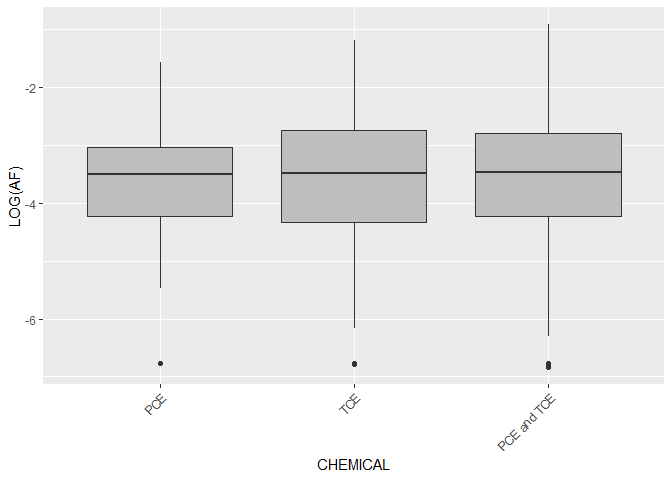<!-- -->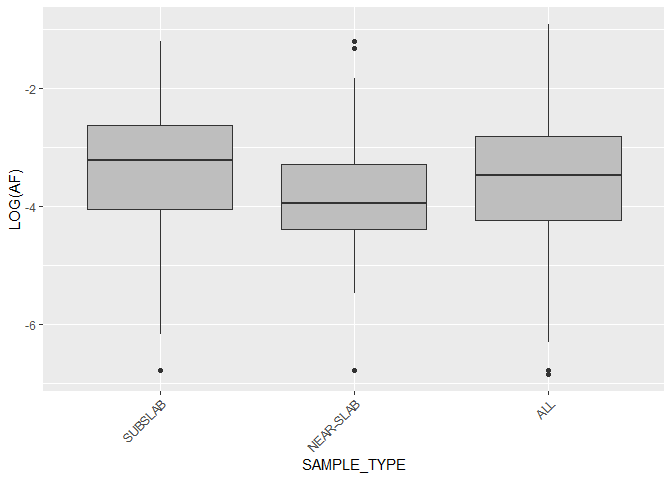<!-- -->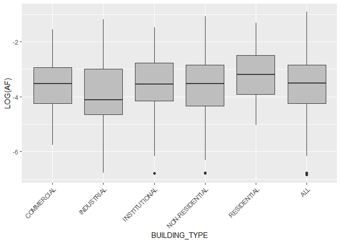<!-- -->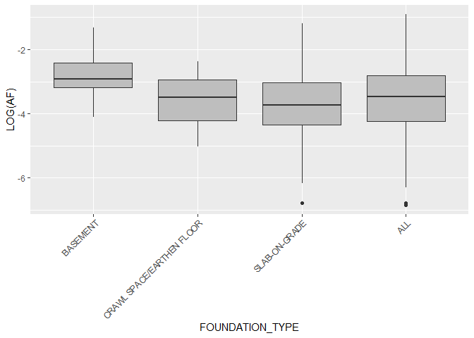<!-- -->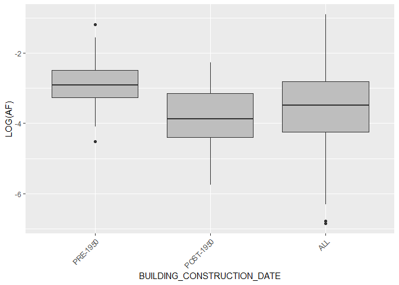<!-- -->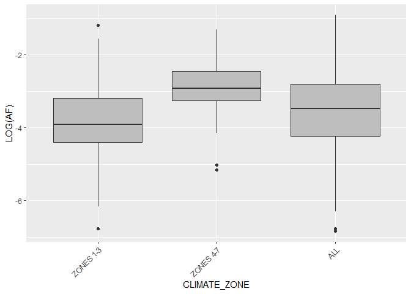<!-- -->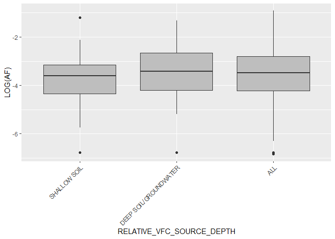<!-- -->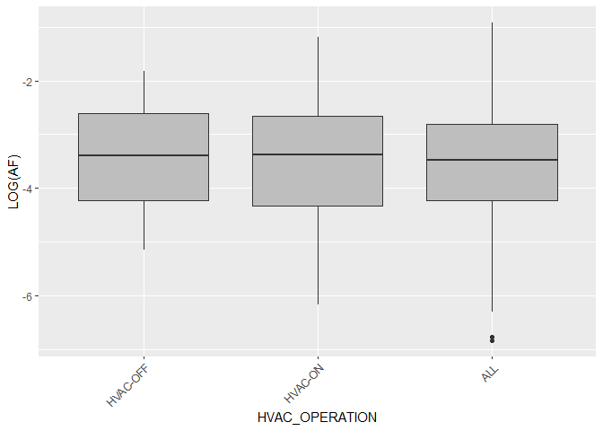<!-- -->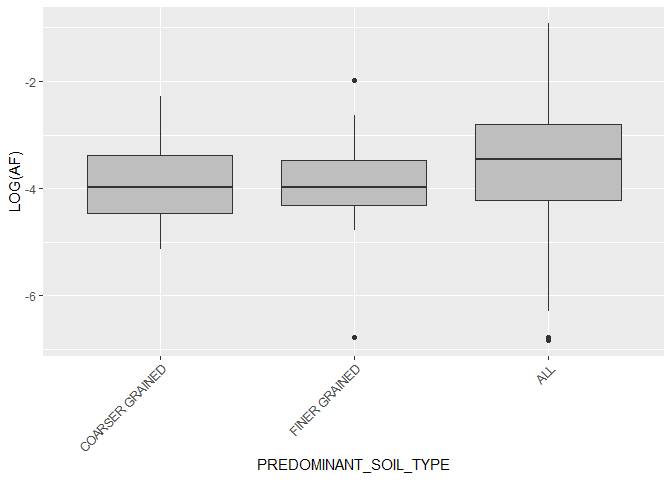<!-- -->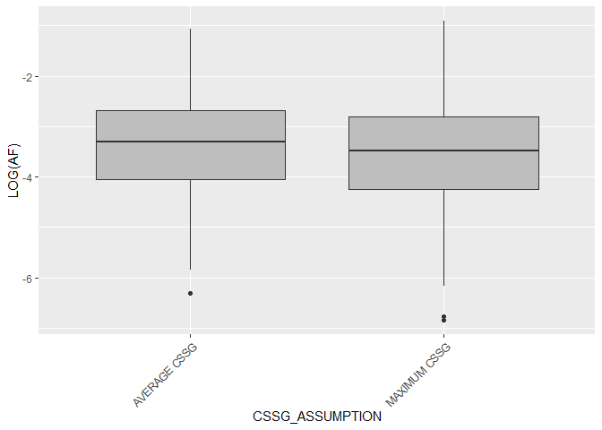<!-- -->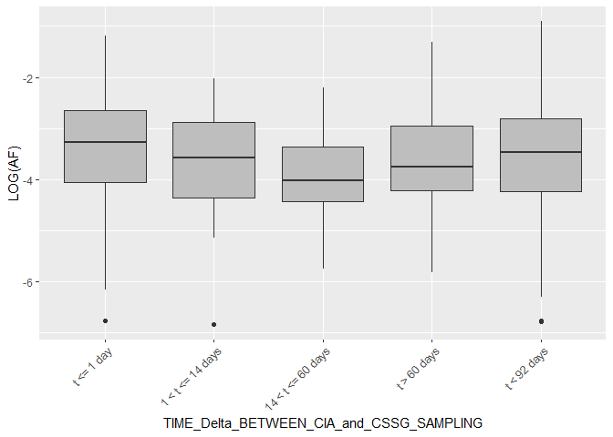<!-- -->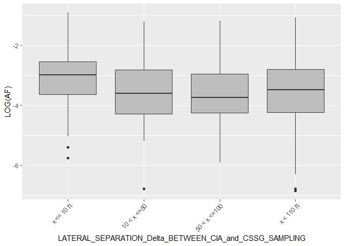<!-- -->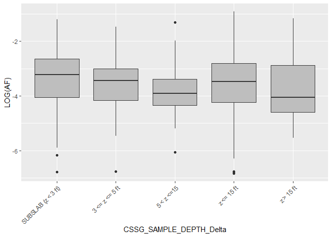<!-- -->

## Statistical Modelling

### Linear Modelling and ANOVA (Analysis of Variance)

``` r
YVar<-"LOG(AF)"
VarNames<-setdiff(names(data),YVar)
lmall<-lm(`LOG(AF)`~.,data)
anova(lmall)
```

    ## Analysis of Variance Table
    ## 
    ## Response: LOG(AF)
    ##                                                          Df Sum Sq Mean Sq F value    Pr(>F)    
    ## CHEMICAL                                                  2    1.2   0.597  0.7335 0.4802912    
    ## SAMPLE_TYPE                                               2   93.6  46.803 57.5323 < 2.2e-16 ***
    ## BUILDING_TYPE                                             5  112.2  22.446 27.5920 < 2.2e-16 ***
    ## FOUNDATION_TYPE                                           3   22.3   7.438  9.1431 4.974e-06 ***
    ## BUILDING_CONSTRUCTION_DATE                                2   38.6  19.301 23.7258 5.621e-11 ***
    ## CLIMATE_ZONE                                              2   47.0  23.483 28.8664 3.491e-13 ***
    ## RELATIVE_VFC_SOURCE_DEPTH                                 2    3.7   1.838  2.2597 0.1045046    
    ## HVAC_OPERATION                                            2    2.9   1.461  1.7964 0.1660145    
    ## PREDOMINANT_SOIL_TYPE                                     2    0.3   0.133  0.1631 0.8495388    
    ## CSSG_ASSUMPTION                                           1    4.0   3.966  4.8750 0.0272985 *  
    ## TIME_Delta_BETWEEN_CIA_and_CSSG_SAMPLING                  4   15.4   3.852  4.7345 0.0008213 ***
    ## LATERAL_SEPARATION_Delta_BETWEEN_CIA_and_CSSG_SAMPLING    3   12.4   4.145  5.0953 0.0016060 ** 
    ## CSSG_SAMPLE_DEPTH_Delta                                   3    9.8   3.270  4.0196 0.0072338 ** 
    ## Residuals                                              4512 3670.5   0.814                      
    ## ---
    ## Signif. codes:  0 '***' 0.001 '**' 0.01 '*' 0.05 '.' 0.1 ' ' 1

#### Removing insignificant variables:

``` r
InSignifVars<-gsub("`","",as.character(na.omit(rownames(as.data.frame(anova(lmall)))[as.vector(as.data.frame(anova(lmall))["Pr(>F)"]>0.05)])))
SignifVars<-gsub("`","",as.character(na.omit(rownames(as.data.frame(anova(lmall)))[as.vector(as.data.frame(anova(lmall))["Pr(>F)"]<0.05)])))
lmSignif<- lm(`LOG(AF)`~.,data[,!names(data) %in% InSignifVars])
anova(lmSignif)
```

    ## Analysis of Variance Table
    ## 
    ## Response: LOG(AF)
    ##                                                          Df Sum Sq Mean Sq F value    Pr(>F)    
    ## SAMPLE_TYPE                                               2   93.1  46.534 57.1288 < 2.2e-16 ***
    ## BUILDING_TYPE                                             5  110.2  22.050 27.0701 < 2.2e-16 ***
    ## FOUNDATION_TYPE                                           3   22.3   7.448  9.1435 4.970e-06 ***
    ## BUILDING_CONSTRUCTION_DATE                                2   39.3  19.658 24.1337 3.754e-11 ***
    ## CLIMATE_ZONE                                              2   46.5  23.258 28.5542 4.751e-13 ***
    ## CSSG_ASSUMPTION                                           1    3.9   3.852  4.7296 0.0297003 *  
    ## TIME_Delta_BETWEEN_CIA_and_CSSG_SAMPLING                  4   15.4   3.843  4.7177 0.0008466 ***
    ## LATERAL_SEPARATION_Delta_BETWEEN_CIA_and_CSSG_SAMPLING    3   12.2   4.066  4.9914 0.0018589 ** 
    ## CSSG_SAMPLE_DEPTH_Delta                                   4   10.1   2.528  3.1031 0.0146231 *  
    ## Residuals                                              4519 3680.9   0.815                      
    ## ---
    ## Signif. codes:  0 '***' 0.001 '**' 0.01 '*' 0.05 '.' 0.1 ' ' 1

#### Investigate individual effects using the R “effects” package:

``` r
for(i in SignifVars){

  plot(predictorEffects(predictor=i,mod=lmSignif), axes=list(grid=TRUE,
                      x=list(rotate=45,cex=0.75)),lines=list(lty=0),ylim=c(-4.5,-2))
  
}
```

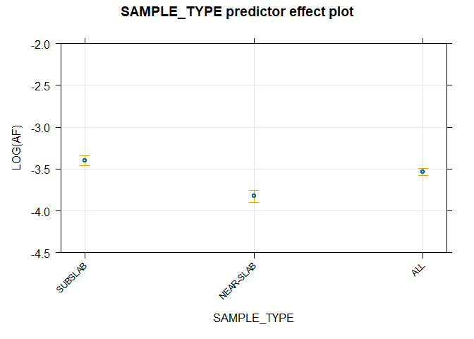<!-- -->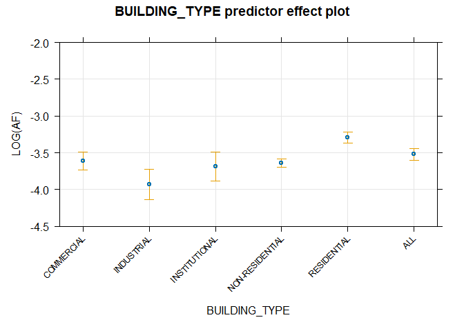<!-- -->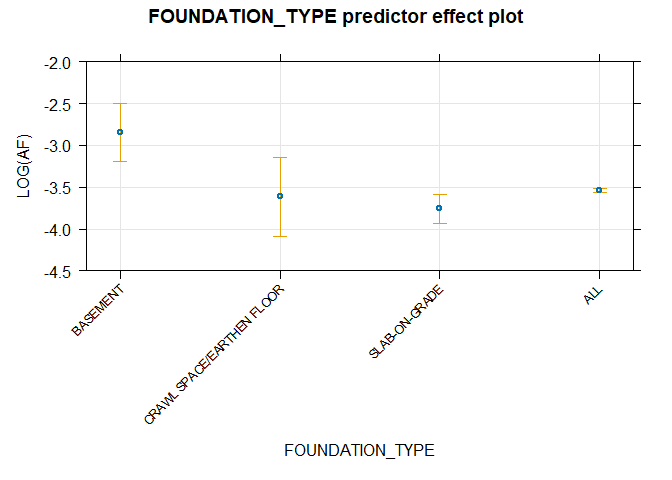<!-- -->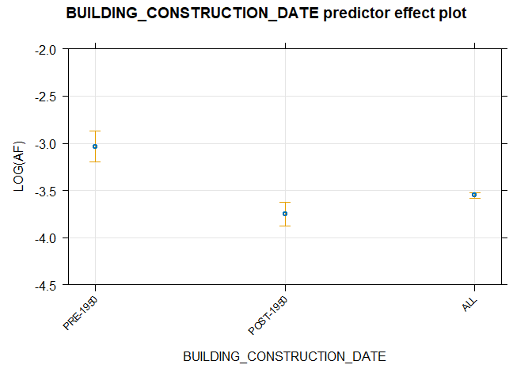<!-- -->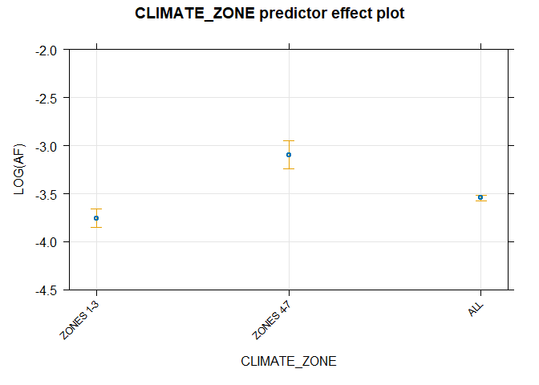<!-- -->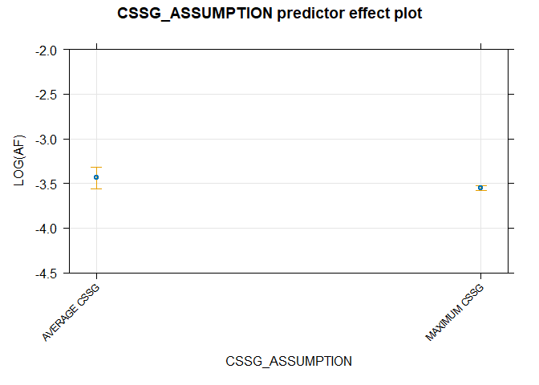<!-- -->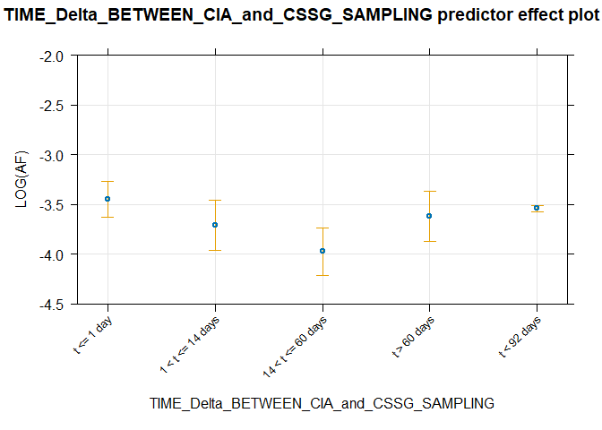<!-- -->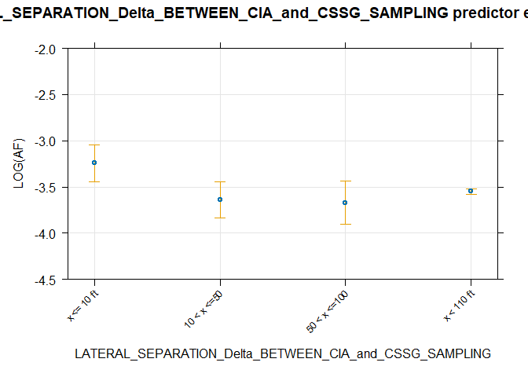<!-- -->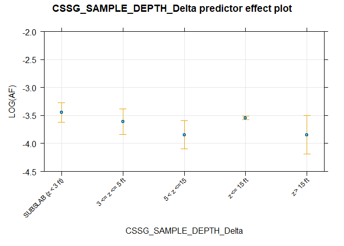<!-- -->
